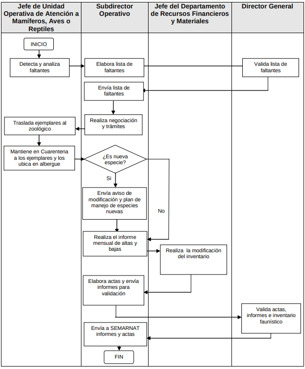
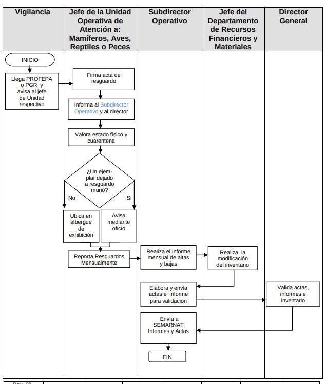
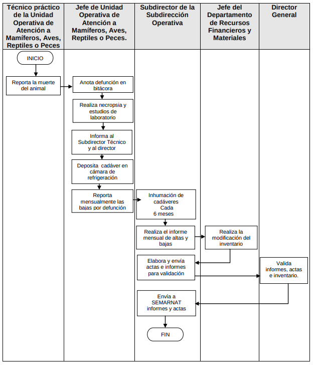
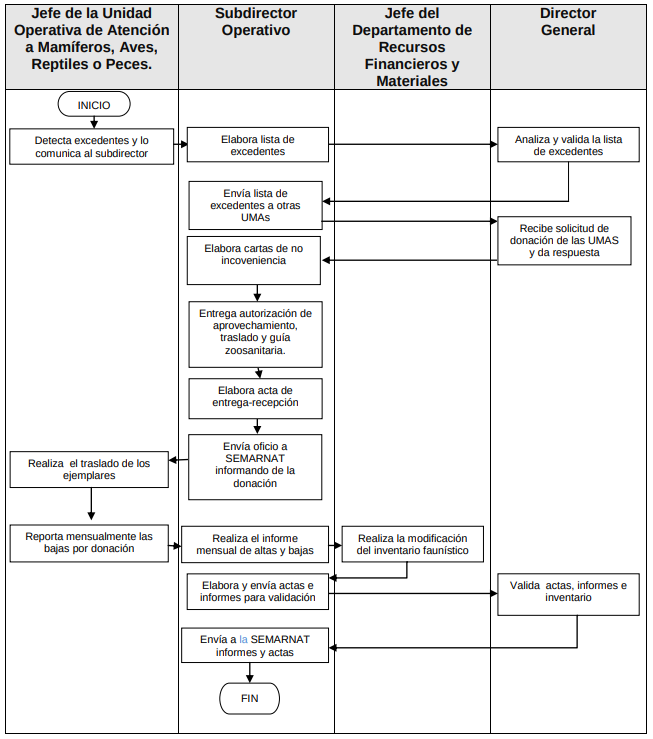
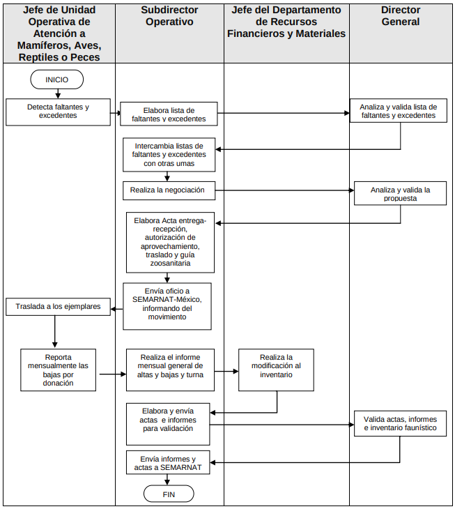
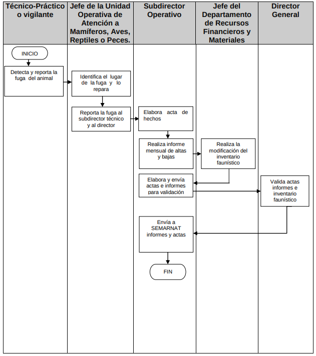
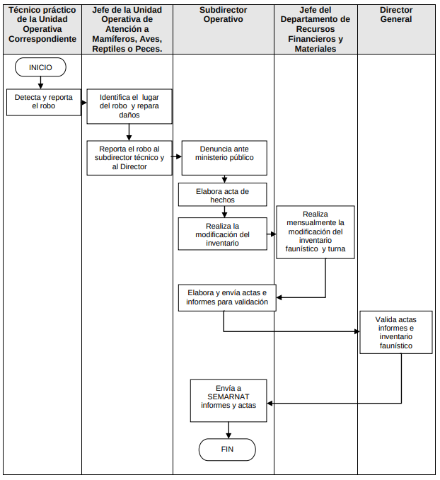

# zoologico_campus

# Scrum

La metodolodogia se llevara acabo por springs y utilizaremos [notion](https://www.notion.so)

# Ramas

* mian : Rama principal del proyecto
* Investigacion : Rama donde se subiran las investigacion y documentacion necesarias
* Desarrolo : Rama donde se realizaran pruebas y desarrollos antes de publicar en la rama main


# Ejecucion local

`Nota : usar nodejs en la version ^v18.17.1`

-Clonar el repositorio O descargar en .ZIP

```bash
  git clone https://github.com/Dannkol/zoologico_campus
```

-Ir al directorio

```bash
  cd zoologico_campus
```

-Install dependencias

```bash
  npm install
```

-Crear archivo .env  siguiendo la guia del  .env_example

-Configurar la cadena de  conexion a mongodb reemplazar la uri actual con la suya en el archivo src/config/connection.js

Start

```bash
  npm run dev
```

Endpoint

La documentacion de los endpoints la puedes encontrar en el siguiente archivo [src/routes/readme.md](src/routes/readme.md)

# Instalacion base de datos

* Base de datos : MongoDB
* Cliente : Atlas
* Documentacion : [Documentacion](docs/database/readme.md)

* Instalacion 
  
  * Ve al archivo [database/zooSchemas.mongodb](database/zooSchemas.mongodb)
  * Ejecuta la creacion de colleciones
  * Ejecuta la innsercion de datos
  * Si tienes problemas prueba con ejecutar una por una las consulta y no todas de golpe


# Investigacion

Un zoológico es una instalación diseñada para albergar y exhibir una variedad de especies animales, con el propósito de educar, conservar y entretener al público. Los zoológicos pueden tener diferentes enfoques, como la conservación de especies en peligro de extinción, la investigación científica, la educación ambiental y la recreación.

Los parques zoológicos son instalaciones compuestas por recintos cercados en los que se exhiben animales a un público interesado. Más allá de cumplir una función de entretenimiento, hoy día, los zoos sirven sobre todo para el estudio de los animales y la conservación de especies en peligro de extinción.

**Funcionamiento de los zoológicos:** (Los procesos y funciones de un zoológico pueden variar según su enfoque y tamaño)

1. **Colección y Exhibición de Animales:** Los zoológicos seleccionan animales de diversas especies para exhibir en recintos diseñados para imitar su hábitat natural. Estos recintos combinan el ocio con la enseñanza, ya que suelen apuntar a entretener y, a la vez, educar a los visitantes.

2. **Conservación:** Las amenazas que enfrentan diferentes especies en su hábitat natural ha hecho necesario contar con estrategias alternativas para su conservación. 

3. **Investigación:** La investigación en los Zoológicos se centra principalmente en temas como nutrición, enriquecimiento ambiental, fisiología, comportamiento, reproducción, biología de la conservación; los resultados de estas investigaciones se aplican al manejo de poblaciones silvestres, repoblación, reintroducción de individuos en sus hábitat naturales, entre otros.

4. **Educación:** Para los Zoológicos, colegios y universidades son un sector muy importante del público visitante. Por esta razón, dedican grandes esfuerzos para elaborar estrategias conjuntas que permitan al Zoológico ser un pilar de apoyo a los docentes en su labor.

5. **Bienestar Animal:** Los zoológicos deben priorizar el bienestar de los animales bajo su cuidado. Esto implica proporcionar una dieta adecuada, atención veterinaria regular, enriquecimiento ambiental (actividades que estimulan los comportamientos naturales) y atención especializada para las necesidades individuales de cada especie.

6. **Diseño de Hábitats:** Los zoológicos modernos se esfuerzan por crear hábitats lo más naturales posible para los animales. Esto implica considerar factores como el espacio, la vegetación, los elementos acuáticos y otros elementos que ayuden a recrear el entorno natural de los animales.

7. **Regulaciones y Ética:** Los zoológicos deben cumplir con regulaciones y normas éticas que se han desarrollado para garantizar el bienestar de los animales y la calidad de vida en cautividad. Estas regulaciones pueden variar según el país y la región.


# Adquisición de animales

Muchos zoologicos obtiene sus animales por medio de diversos medios como donaciones entre zoologicos, instituciones, paises, particulares y rescatres segun Manual de Procedimientos del Parque Zoológico “Benito Juárez”, estas adquisiones tienen que ser bajo la ley y cumplir con los siguientes requisitos.

* Las instituciones asociadas, deberán contar y respetar el plan de especie conforme a los
planes de colección y de manejo diseñados por ellos mismos y registrados ente la autoridad
federal.

* Solo es ético recibir animales para los cuales se cuenta con las instalaciones, recursos y
personal adecuados para su mantenimiento.

* Toda adquisición de ejemplares se debe llevar a cabo con instituciones que cuenten con las
autorizaciones legales correspondientes y antecedentes claros, cuidando en todo momento
cumplir con las condiciones adecuadas durante el traslado conforme a la normatividad vigente.


y se realizan bajo el siguente flujograma

### Adquisiciónes regulares

Entiendase como la forma regular para adquirir nuevos animales


<blockquote cite="http://publicadorlaip.michoacan.gob.mx/26/M%20P%20Zoologico%20REGISTRADO.pdf">
  <p>Flujograma para la Adquisiciónes regulares</p>
  <footer>- Manual de Procedimientos del Parque Zoológico “Benito Juárez”</footer>
</blockquote>

### Adquisiciónes por decomiso

A veces el zoologico recibe animales decomisados


<blockquote cite="http://publicadorlaip.michoacan.gob.mx/26/M%20P%20Zoologico%20REGISTRADO.pdf">
  <p>Flujograma para la Adquisiciónes por decomiso</p>
  <footer>- Manual de Procedimientos del Parque Zoológico “Benito Juárez”</footer>
</blockquote>


# Baja de animales

El zoologico tiene que seguir ciertas normativas con las bajas de los animales.

* Los miembros que envíen animales a otra institución se asegurarán que ésta tenga las
condiciones necesarias de alojamiento para los ejemplares que recibirá.

* Todos los animales que sean trasladados irán acompañados de sus registros médicos, dieta
actual, estatus reproductivo y características especiales de manejo médico y comportamiento.
Si es necesario deberán estar acompañados de personal calificado para su manejo, durante
toda la etapa de entrega-recepción.

## Tipos de bajas y flujograma

### Bajas por defuncion

Se considera baja por defunción, cuando un ejemplar muere y debe ser excluido del inventario
faunístico.


<blockquote cite="http://publicadorlaip.michoacan.gob.mx/26/M%20P%20Zoologico%20REGISTRADO.pdf">
  <p>Flujograma para las Baja por Defuncion</p>
  <footer>- Manual de Procedimientos del Parque Zoológico “Benito Juárez”</footer>
</blockquote>

### Baja por Donación

Se considera baja por donación, cuando un ejemplar es donado a otra UMA y debe ser excluido
del inventario faunístico.


<blockquote cite="http://publicadorlaip.michoacan.gob.mx/26/M%20P%20Zoologico%20REGISTRADO.pdf">
  <p>Flujograma para la Baja por Donación</p>
  <footer>- Manual de Procedimientos del Parque Zoológico “Benito Juárez”</footer>
</blockquote>

### Baja por Intercambio

El zoologico puede realizar intercambios de animales


<blockquote cite="http://publicadorlaip.michoacan.gob.mx/26/M%20P%20Zoologico%20REGISTRADO.pdf">
  <p>Flujograma para la Baja por Intercambio</p>
  <footer>- Manual de Procedimientos del Parque Zoológico “Benito Juárez”</footer>
</blockquote>

### Baja por Fuga 

Puede darse el caso de la fuja de un animal


<blockquote cite="http://publicadorlaip.michoacan.gob.mx/26/M%20P%20Zoologico%20REGISTRADO.pdf">
  <p>Flujograma para la Baja por Fuga</p>
  <footer>- Manual de Procedimientos del Parque Zoológico “Benito Juárez”</footer>
</blockquote>

### Baja por Robo 

Puede darse el caso del robo de un animal


<blockquote cite="http://publicadorlaip.michoacan.gob.mx/26/M%20P%20Zoologico%20REGISTRADO.pdf">
  <p>Flujograma para la Baja por Robo</p>
  <footer>- Manual de Procedimientos del Parque Zoológico “Benito Juárez”</footer>
</blockquote>

### Alta de personal

Se denomina alta al trabajador que es de nuevo ingreso al Parque Zoológico y que éste sea 
registrado en la plantilla de trabajadores al servicio del Gobierno del Estado.


<blockquote cite="http://publicadorlaip.michoacan.gob.mx/26/M%20P%20Zoologico%20REGISTRADO.pdf">
  <p>Flujograma para la alta de Personal</p>
  <footer>- Manual de Procedimientos del Parque Zoológico “Benito Juárez”</footer>
</blockquote>


En el Manual de Procedimientos del Parque Zoológico “Benito Juárez” nos encontraremos demas guias y pasos a realizar para eventos que van desde los accidentes como Extracción de elefantes de Fosos hasta la atencion a colegios y visitantes.

### Baja de personal

Se denomina baja de personal al trabajador de la plantilla de trabajadores al servicio del 
Gobierno del Estado que incide en las causas de renuncia, abandono, muerte o jubilación. 


<blockquote cite="http://publicadorlaip.michoacan.gob.mx/26/M%20P%20Zoologico%20REGISTRADO.pdf">
  <p>Flujograma para la baja de personal</p>
  <footer>- Manual de Procedimientos del Parque Zoológico “Benito Juárez”</footer>
</blockquote>


## Análisis de Requerimientos: Gestión de un Zoológico

El presente análisis tiene como objetivo comprender las necesidades y metas para la implementación de un sistema de gestión integral para un zoológico. Este sistema busca mejorar la administración de animales, exhibiciones, investigación, operaciones y ventas, garantizando una experiencia positiva tanto para visitantes como para el personal.


#### Administración de Animales:

- **Sistema de registro de animales:** Se debe implementar una base de datos que permita registrar información detallada de cada animal, incluyendo especie, género, edad, historial médico, origen y otros datos relevantes para su cuidado.
- **Gestión de bajas de animales:** El sistema debe permitir registrar diferentes tipos de bajas de animales, como defunción, donación, intercambio, robo o fuga. Esto ayudará a mantener un registro completo de los movimientos de los animales.
- **Búsqueda de animales:** Se debe desarrollar una función de búsqueda que permita a los cuidadores localizar animales según su especie, hábitat o nombre, facilitando el seguimiento y la ubicación de cada individuo.
- **Gestión de suministros:** El sistema debe incluir una herramienta para gestionar los suministros necesarios para los animales. Esto implica registrar la cantidad, fecha y horas específicas de entrega de alimentos, medicamentos y otros elementos esenciales.

#### **Gestión de Visitantes:**

- **Calendario de exhibiciones:** El sistema debe mostrar un calendario actualizado de exhibiciones y presentaciones para los visitantes, permitiendo planificar su visita en función de los horarios de actividades.
- **Tarifas y categorías:** Se debe establecer un módulo que permita definir tarifas de entrada según las categorías de visitantes, como niños, adultos, estudiantes, grupos, etc. Esto facilitará la gestión de la facturación y la planificación financiera.
- **Registro de información personal:** El sistema debe capturar y almacenar información personal de los visitantes para fines de registro y seguimiento, asegurando el cumplimiento de regulaciones de privacidad y seguridad de datos.

#### **Gestión de Hábitats:**

- **Mantenimiento de instalaciones:** Se debe incorporar un sistema de gestión de mantenimiento para programar y realizar mantenimientos preventivos y correctivos en las instalaciones y equipos, garantizando la seguridad de los animales y visitantes.

#### **Gestión Personal:**

- **Registro del personal calificado:** El sistema debe permitir registrar a todo el personal calificado, desde cuidadores hasta veterinarios y guías turísticos, con detalles sobre su experiencia y habilidades.
- **Baja de personal:** Debe existir un proceso para registrar la baja de personal y eliminar su acceso al sistema en caso de renuncia, jubilación u otros motivos.

#### **Investigación:**

- **Información detallada sobre especies:** Se debe proporcionar una base de datos con información detallada sobre cada especie presente en el zoológico, incluyendo aspectos relacionados con su biología, comportamiento y estado de conservación. Esto puede ayudar en la educación y la investigación.


Este sistema de gestión integral ayudará a optimizar la operación del zoológico al proporcionar herramientas para administrar animales, visitantes, hábitats, personal e investigación de manera eficiente. La implementación de estos requisitos contribuirá a la mejora de la experiencia tanto para los visitantes como para el personal involucrado en la gestión del zoológico.

# Bibliografias

- [Node js Documentación.](https://nodejs.org/es/docs)
- [Mongo Db Documentación.](https://www.mongodb.com/docs/)
- Duran Pizarroso, C. P. Manual de administración de almacenes del Zoológico Municipal de la ciudad de La Paz en base al Sistema de Administración de Bienes y Servicios (Doctoral dissertation).
- [Parque Zoológico Nacional, Oficina de Acceso a la Información Pública
Manual de Procedimientos (Rep.Dom) Recuperado el 8 de agosto de 2023.](https://zoodom.gob.do/transparencia/phocadownload/OAI/2023/Manual-de-Procedimientos-OAI.pdf)
- [MANUAL DE PROCEDIMIENTOS
PARQUE ZOOLÓGICO
“BENITO JUÁREZ](http://publicadorlaip.michoacan.gob.mx/26/M%20P%20Zoologico%20REGISTRADO.pdf)”
- [¿Qué son los zoologicos? (ZOO Córdoba) Recuperado el 8 de agosto de 2023.](https://zoo-cordoba.com.ar/zoo/que-son-los-zoologicos.html)
